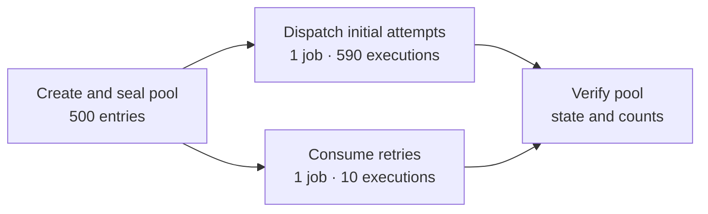
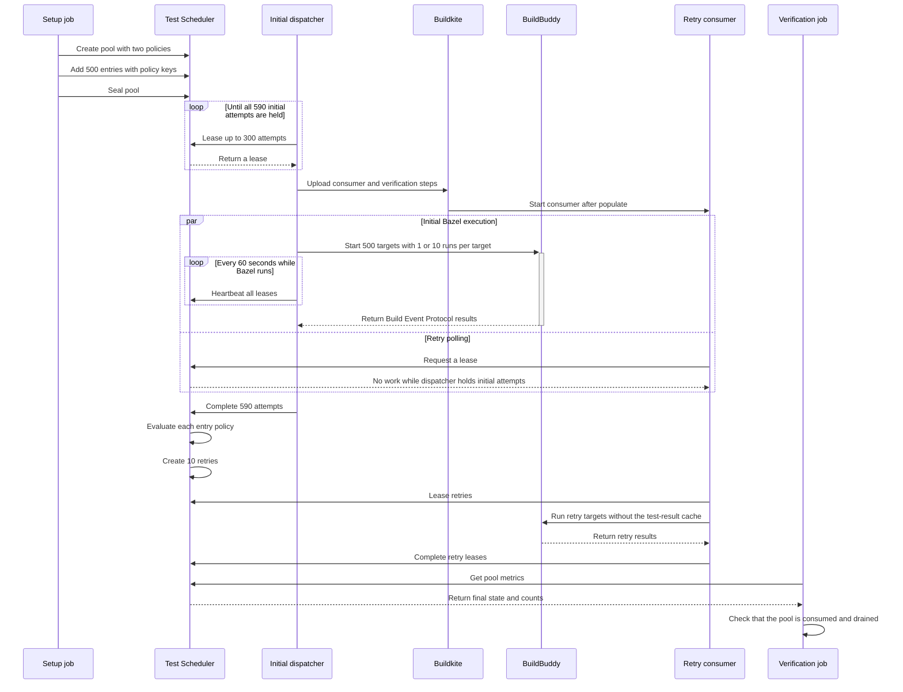

# Test Scheduler Bazel demo

This repository shows how Buildkite Test Scheduler can control a large Bazel
test workload. The example uses BuildBuddy for Bazel Remote Execution. It
models a large remote-execution workflow.

The demo has 500 Bazel targets. Each target runs one pytest test. Each test
sleeps for 10 ms and then passes or fails.

## Responsibilities

Each system has one main responsibility:

- Buildkite runs the setup, dispatcher, consumer, and verification jobs.
- Test Scheduler stores work and decides when an entry needs another attempt.
- Bazel converts each target run into a test action.
- BuildBuddy executes Bazel actions and stores cached results.
- pytest runs the test function inside each Bazel action.

The Buildkite jobs keep all Test Scheduler credentials. A remote action only
receives the files and environment values that Bazel declares for that action.

## Terms

| Term | Meaning in this demo |
| --- | --- |
| Pool | The complete set of test work for one build. |
| Entry | One Bazel target in the pool. |
| Selector | The Bazel label stored in an entry, such as `//demo:target_42`. |
| Policy | The rules that decide how many attempts an entry needs. |
| Attempt | One planned execution of one entry. |
| Initial attempt | An attempt that Test Scheduler creates when the entry is added. |
| Retry | An attempt that Test Scheduler creates after it evaluates results. |
| Lease | Temporary ownership of one or more attempts by a Buildkite job. |
| Heartbeat | A request that extends a lease while work continues. |

## What the demo shows

The pipeline does these tasks:

1. The setup job creates a Test Scheduler pool.
2. The setup job adds 500 targets to the pool.
3. Each target selects one of two policies.
4. The setup job seals the pool.
5. The initial dispatcher leases all 590 initial attempts.
6. The dispatcher dynamically adds the consumer and verification jobs.
7. The dispatcher sends all initial attempts to BuildBuddy in one Bazel
   invocation.
8. The consumer polls Test Scheduler while the initial invocation runs.
9. The dispatcher sends the initial results to Test Scheduler.
10. The consumer leases and runs retries as soon as they are available.
11. The verification job checks the final pool state and counts.

## Policies

The pool has two immutable policies. An immutable policy cannot change after
the pool is created.

| Policy | Targets | Initial attempts per target | Required result | Maximum attempts |
| --- | ---: | ---: | --- | ---: |
| `default` | 490 | 1 | 1 pass | 2 |
| `qualification` | 10 | 10 | 10 passes | 10 |

Ten targets in the `default` group fail their initial attempt. Test Scheduler
creates one retry for each of these targets. The retries pass.

All ten targets in the `qualification` group pass. Each target must pass ten
times. This group does not need retries.

The `default` policy creates one attempt immediately. It requires one pass. It
permits two total attempts. It also permits one failure before the entry stops.
An entry with one initial failure therefore gets one retry.

The `qualification` policy creates ten attempts immediately. It requires ten
passes and permits only ten total attempts. Its `max_failed` value is one. One
failure therefore makes the entry fail without a retry.

An entry selects a policy with the `attempt_policy` key. An entry without a
policy key uses the `default` policy. Policy definitions and entry selections
do not change after the pool is created.

The expected totals are:

- 590 initial executions
- 10 retry executions
- 600 completed executions
- 590 passed attempts
- 10 intentional failed attempts

## Pool lifecycle

The setup job creates the pool in the `populating` state. The pool accepts
entries only in this state. The setup job adds all 500 entries in five requests
of 100 entries. It then sets `populating` to false. This action seals the pool
and makes the initial attempts available for leases.

The pool is `consuming` while attempts are waiting, leased, or under policy
evaluation. An entry is finished when its selected policy decides that it
passed or failed. The pool becomes `consumed` when all entries are finished. The
pool is drained when no attempt is waiting or leased.

The pool key includes the Buildkite build ID. This key prevents two builds from
using the same pool. The setup job stores the pool ID in Buildkite build
metadata. Later jobs read the ID from that metadata.

## Limits used by the demo

| Setting | Value | Purpose |
| --- | ---: | --- |
| Pool lifetime | 3,600 seconds | Removes abandoned pool work after one hour. |
| Entry custom cost | 1 | Gives each attempt the same lease cost. |
| Lease custom cost | 300 | Limits one lease to 300 units of work. |
| Attempts per lease | 300 | Limits one lease to 300 attempts. |
| Initial lease lifetime | 600 seconds | Gives the dispatcher time to start its heartbeat. |
| Initial heartbeat interval | 60 seconds | Extends all leases while Bazel runs. |
| Retry lease lifetime | 300 seconds | Returns abandoned retry work after five minutes. |
| Completion request limit | 5,000 attempts | Sets the maximum result batch size in the client. |

Each initial attempt costs one unit. One lease can therefore hold at most 300
attempts. The dispatcher normally uses one 300-attempt lease and one
290-attempt lease for the 590 initial attempts.

## Build graph

The static pipeline contains the population and initial dispatcher jobs. The
dispatcher adds the consumer and verification jobs after it holds every initial
lease. The consumer depends only on the `populate` step. It can therefore run
at the same time as the initial dispatcher. The verification job depends on
both jobs.



The dispatcher uses the Buildkite Python SDK to define the dynamic command
steps. It sends the generated YAML to `buildkite-agent pipeline upload`. The
consumer starts only after the dispatcher holds all initial work, so it cannot
take an initial attempt during normal operation.

One consumer can lease all ten retries in one request. Five consumers would not
increase throughput for this workload. Buildkite automatic retries provide
replacement capacity when the consumer cannot finish.

The static pipeline defines the `hosted` agent queue and `BUILDBUDDY_API_KEY` at
the top level. The SDK adds the same settings to the dynamic consumer. The
verification job does not need the BuildBuddy secret.

The pipeline also requests the `.buildkite/cache-volume` cache volume. On a
Buildkite hosted agent, the mise plugin detects this volume and uses
`/cache/bkcache/mise` as `MISE_DATA_DIR`. Parallel jobs can reuse downloaded
mise tools from this shared directory. The plugin stages downloads and moves
them into place atomically, so concurrent jobs can safely share the cache.

## Request sequence



## Bazel execution

The dispatcher requests initial leases sequentially. Each request can return up
to 300 attempts. The dispatcher does not start Bazel until it holds all 590
initial attempts. This loop drains only the initial queue. Test Scheduler
creates retries after it receives the initial results.

The dispatcher uses this wait point intentionally. It lets one Bazel invocation
submit the complete initial workload. BuildBuddy can then schedule the actions
across its workers. The lease requests do not run in parallel.

The initial dispatcher uses one Bazel invocation. It uses `--runs_per_test=1`
for the `default` targets. It uses `--runs_per_test=10` for the
`qualification` targets. It sets `--jobs=590` so that Bazel can submit all
initial actions without a small local concurrency limit.

Initial runs use `--cache_test_results=auto`. The 490 default targets run once,
so their initial results can come from the cache. The ten qualification targets
run ten times. Bazel auto mode does not use cached test results when
`--runs_per_test` is greater than one. Each qualification attempt is therefore
an independent execution. Retry runs use `--nocache_test_results`, so each
retry also executes again.

A cached default result still produces a Build Event Protocol result. The
dispatcher can therefore complete the matching Test Scheduler attempt whether
BuildBuddy executes the action or returns a cached result. Qualification and
retry results do not use the test-result cache.

The dispatcher reads the Bazel Build Event Protocol file. It matches each
result to a Test Scheduler attempt. The dispatcher sends all 590 initial
results in one completion request.

Bazel numbers runs from one. Test Scheduler numbers attempts from zero. The
dispatcher subtracts one from each Bazel run number before it matches a result.
It stops without completing leases if any expected result is missing.

The completion client keeps all attempts from one lease in the same request.
The current 590-attempt workload needs one completion request and stays below
the 5,000-attempt API limit. The dispatcher fails before it leases work if a
future workload exceeds this limit. It does not send a partial completion that
a replacement job cannot reconcile.

The Buildkite job owns the Test Scheduler leases. Remote Bazel actions do not
receive Buildkite credentials or the BuildBuddy API key.

## Retry consumption

The dispatcher uploads the retry consumer after it leases all 590 initial
attempts. The consumer depends only on the `populate` step, so Buildkite can
start it while the initial Bazel invocation runs. Its early lease requests
return no work because the dispatcher holds every initial attempt.

Test Scheduler evaluates the 500 entries after it receives the initial results.
It creates ten retries for the ten entries that have no pass.

The consumer waits for a lease. It can lease all ten retries in one request.
It keeps polling until the pool is consumed.

The consumer releases an initial attempt if it receives one. This case can occur
when the dispatcher loses its agent and an initial lease expires. Releasing the
lease lets the replacement dispatcher take the work. The consumer groups retry
attempts by attempt index because one Bazel invocation uses one
`DEMO_ATTEMPT_INDEX` value.

The consumer polls every ten seconds when no work is available. It stops when
the pool is consumed. It exits with status 75 after 90 empty or unavailable
polls. This gives policy evaluation and expired leases up to 15 minutes to
produce work. Buildkite can retry status 75 two times.

## Failure recovery

The initial dispatcher sends a heartbeat every 60 seconds. This heartbeat
keeps its Test Scheduler leases active while Bazel runs.

Buildkite can retry the dispatcher if its agent stops. If the dispatcher no
longer sends heartbeats, its leases expire. Test Scheduler then makes the
attempts available again.

The dispatcher checks the attempt index in each lease. A restarted dispatcher
releases a lease if it contains policy-generated retries. This prevents the
initial job from taking work that belongs to the retry consumer.

A retried dispatcher checks whether the dynamic consumer already exists before
it uploads the dynamic pipeline. This check prevents duplicate step keys. If an
upload reports a connection failure, the dispatcher checks the build again
before it treats the upload as failed.

The demo does not reconnect to an existing BuildBuddy invocation. A retried
dispatcher starts Bazel again. Bazel can use cached default results when they
are available. It executes qualification attempts again.

If the retry consumer loses its agent, Buildkite records exit status -1 and
starts a replacement job. If the consumer reaches its polling limit or a
temporary scheduler request fails, it exits with status 75. Buildkite also
starts a replacement job for this status. Each rule permits two replacements.

An abandoned lease expires after 300 seconds. A replacement consumer polls
until it can lease that work. Other exit statuses are not retried. A Bazel or
configuration error therefore remains visible instead of causing repeated
jobs.

## Tools and authentication

The pipeline uses the Buildkite mise plugin. Mise installs these tools:

- Bazelisk
- Python
- uv
- Zig

Zig provides the C and archive tools that `rules_python` resolves during Bazel
analysis. The pytest targets do not compile C or C++ code.

uv creates the Python dependency lock. `rules_python` provides the Python
toolchain and installs the locked packages for Bazel. A test action does not
resolve packages from the network. This makes the Python test environment
repeatable.

The Buildkite Python SDK creates the retry consumer and verification command
steps. The SDK serializes these typed objects to YAML. The Buildkite Agent then
uploads the YAML to the current build.

The pipeline gets `BUILDBUDDY_API_KEY` from a Buildkite cluster secret. The
Test Scheduler client uses a short-lived Buildkite Agent OpenID Connect (OIDC)
token. The small `httpx` client in `.buildkite/test_scheduler_client.py` sends
Test Scheduler requests. The demo does not use `bktec`.

The OIDC token has a 30-minute lifetime. Its claims identify the organization,
pipeline, build, and job. Test Scheduler uses these claims to limit each
request to the current Buildkite context.

The demo expects these Buildkite resources:

- A pipeline that reads `.buildkite/pipeline.yml` from this repository.
- A Test Engine suite with the slug `test-scheduler-bazel-demo`.
- Test Scheduler access for the organization and pipeline.
- Multiple attempt policies enabled for the organization.
- A cluster secret named `BUILDBUDDY_API_KEY`.

The scheduler scripts must run in a Buildkite job. They call
`buildkite-agent oidc request-token` and use Buildkite build metadata. A local
developer can run the Bazel tests, but cannot run the complete scheduler flow
without equivalent Buildkite job context.

All orchestration scripts are Python files. Mise tasks run them with this
command form:

```text
uv run --frozen python <script>
```

## Important files

| File | Purpose |
| --- | --- |
| `.buildkite/pipeline.yml` | Defines pool population and initial dispatch. |
| `.buildkite/setup_pool.py` | Creates, fills, and seals the pool. |
| `.buildkite/dispatch_initial.py` | Leases and runs all initial attempts. |
| `.buildkite/consume_pool.py` | Leases and runs policy-generated retries. |
| `.buildkite/verify_pool.py` | Checks the final pool metrics. |
| `.buildkite/test_scheduler_client.py` | Sends authenticated API requests. |
| `demo/test_demo.py` | Defines the 500 pytest tests. |
| `demo/BUILD.bazel` | Defines the 500 Bazel test targets. |

## Update Python dependencies

After you change Python dependencies, run this command:

```shell
mise run lock-bazel
```

This command exports the uv lock data to `requirements_lock.txt`.
`rules_python` uses this file for the Bazel dependency lock.
