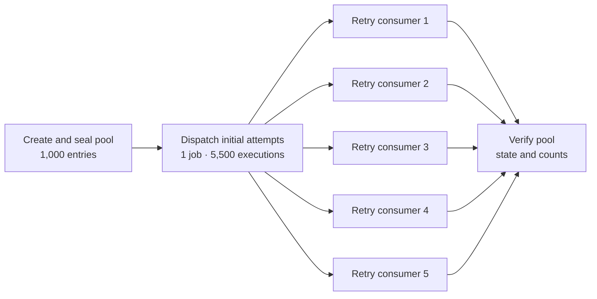
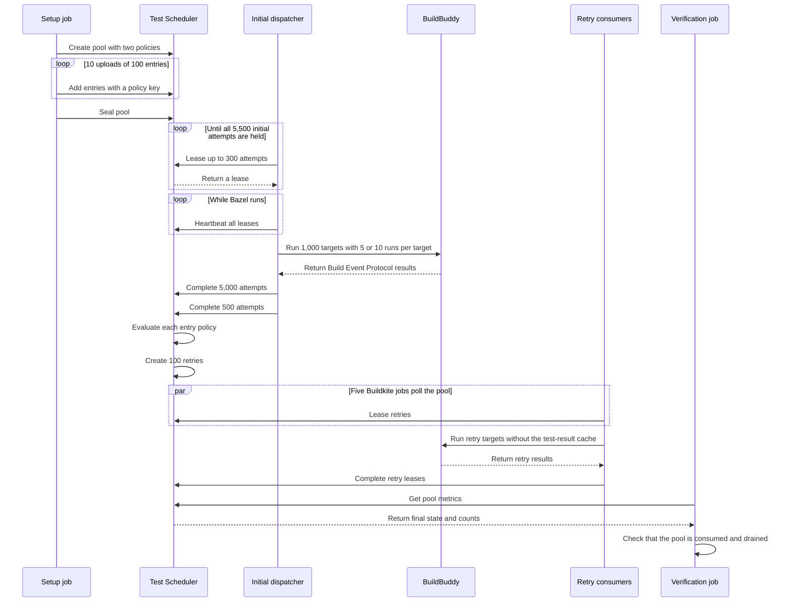

# Test Scheduler Bazel demo

This repository shows how Buildkite Test Scheduler can control a large Bazel
test workload. The example uses BuildBuddy for Bazel Remote Execution. It
models a large remote-execution workflow.

The demo has 1,000 Bazel targets. Each target runs one pytest test. Each test
sleeps for 10 ms and then passes or fails.

## What the demo shows

The pipeline does these tasks:

1. It creates a Test Scheduler pool.
2. It adds 1,000 targets to the pool.
3. It applies one of two policies to each target.
4. It seals the pool.
5. It leases all 5,500 initial attempts in one Buildkite job.
6. It sends all initial attempts to BuildBuddy in one Bazel invocation.
7. It sends the results to Test Scheduler.
8. It uses five Buildkite jobs to consume retries.
9. It verifies the final pool state and counts.

## Policies

The pool has two immutable policies. An immutable policy cannot change after
the pool is created.

| Policy | Targets | Initial attempts per target | Required result | Maximum attempts |
| --- | ---: | ---: | --- | ---: |
| `default` | 900 | 5 | 5 passes | 6 |
| `qualification` | 100 | 10 | 10 passes | 10 |

One hundred targets in the `default` group fail their first attempt. They pass
their other initial attempts. Test Scheduler creates one retry for each of
these targets.

All targets in the `qualification` group pass. Each target must pass ten times.
This group does not need retries.

The expected totals are:

- 5,500 initial executions
- 100 retry executions
- 5,600 completed executions
- 5,500 passed attempts
- 100 intentional failed attempts

## Build graph

The setup job and the initial dispatcher run once. The retry step has five
parallel jobs. The verification job starts after all retry jobs finish.



The five retry jobs compete for available work. Test Scheduler can give all
retries to one job. The other jobs continue to poll until the pool is consumed.
This behavior is expected. The extra jobs give spare consumer capacity.

## Request sequence



## Bazel execution

The initial dispatcher uses one Bazel invocation. It uses `--runs_per_test=5`
for the `default` targets. It uses `--runs_per_test=10` for the
`qualification` targets. It sets `--jobs=5500` so that Bazel can submit all
initial actions without a small local concurrency limit.

Initial runs can use the Bazel test-result cache. Retry runs use
`--nocache_test_results`. This setting makes each retry execute again.

The dispatcher reads the Bazel Build Event Protocol file. It matches each
result to a Test Scheduler attempt. The completion API accepts at most 5,000
attempts in one request. The dispatcher therefore sends the 5,500 initial
results in two requests.

The Buildkite job owns the Test Scheduler leases. Remote Bazel actions do not
receive Buildkite credentials or the BuildBuddy API key.

## Failure recovery

The initial dispatcher sends a heartbeat every 60 seconds. This heartbeat
keeps its Test Scheduler leases active while Bazel runs.

Buildkite can retry the dispatcher if its agent stops. If the dispatcher no
longer sends heartbeats, its leases expire. Test Scheduler then makes the
attempts available again.

The demo does not reconnect to an existing BuildBuddy invocation. A retried
dispatcher starts Bazel again. Bazel can use cached results when they are
available.

## Tools and authentication

The pipeline uses the Buildkite mise plugin. Mise installs these tools:

- Bazelisk
- Python
- uv
- Zig

Zig provides the C and archive tools that `rules_python` resolves during Bazel
analysis. The pytest targets do not compile C or C++ code.

`rules_uv` and `rules_python` provide the Python toolchain and locked Python
packages. A test action does not resolve packages from the network. This makes
the Python test environment repeatable.

The pipeline gets `BUILDBUDDY_API_KEY` from a Buildkite cluster secret. Test
Engine and Test Scheduler use a short-lived Buildkite Agent OIDC token. The
small `httpx` client in `.buildkite/test_scheduler_client.py` sends Test
Scheduler requests. The demo does not use `bktec`.

All orchestration scripts are Python files. Mise tasks run them with this
command form:

```text
uv run --frozen python <script>
```

## Important files

| File | Purpose |
| --- | --- |
| `.buildkite/pipeline.yml` | Defines the Buildkite graph. |
| `.buildkite/setup_pool.py` | Creates, fills, and seals the pool. |
| `.buildkite/dispatch_initial.py` | Leases and runs all initial attempts. |
| `.buildkite/consume_pool.py` | Leases and runs policy-generated retries. |
| `.buildkite/verify_pool.py` | Checks the final pool metrics. |
| `.buildkite/test_scheduler_client.py` | Sends authenticated API requests. |
| `demo/test_demo.py` | Defines the 1,000 pytest tests. |
| `demo/BUILD.bazel` | Defines the 1,000 Bazel test targets. |

## Update Python dependencies

After you change Python dependencies, run this command:

```shell
mise run lock-bazel
```

This command exports the uv lock data to `requirements_lock.txt`.
`rules_python` uses this file for the Bazel dependency lock.

## Buildkite resources

- [Pipeline](https://buildkite.com/catkins-test/test-scheduler-bazel-demo)
- [Passing multi-policy build](https://buildkite.com/catkins-test/test-scheduler-bazel-demo/builds/23)
- [Test Engine suite](https://buildkite.com/organizations/catkins-test/analytics/suites/test-scheduler-bazel-demo)
